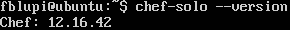
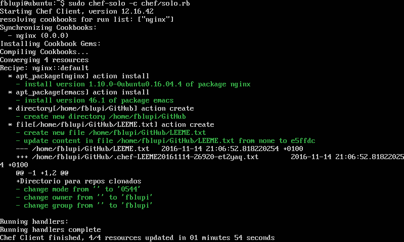
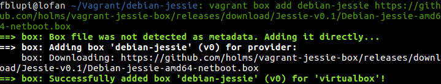
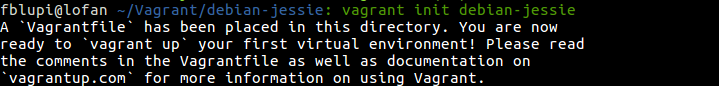
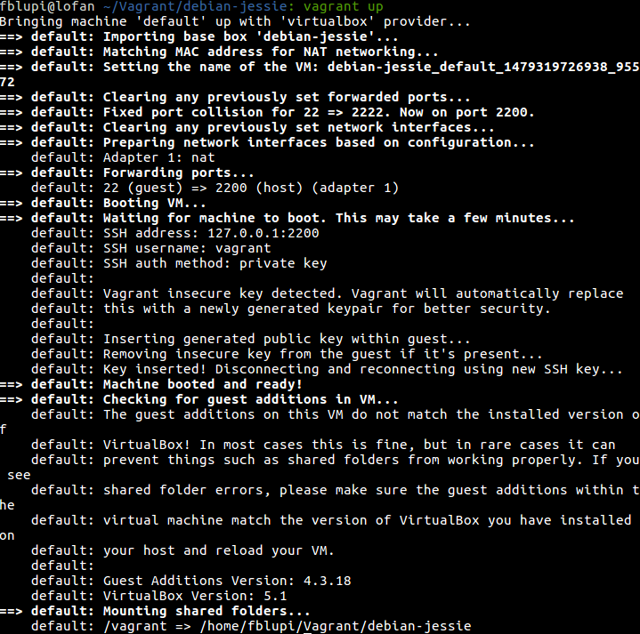
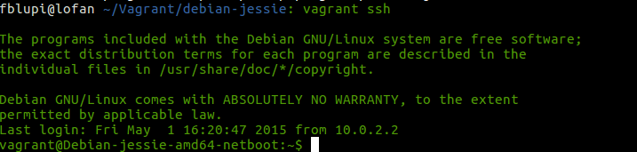
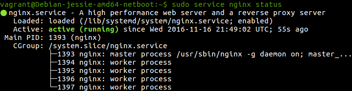

# Ejercicios

## Tema 2: Gestión de infraestructuras virtuales

### Ejercicio 1

**Instalar chef en la máquina virtual que vayamos a usar**

```
curl -L https://www.opscode.com/chef/install.sh | sudo bash
```



### Ejercicio 2

**Crear una receta para instalar nginx, tu editor favorito y algún directorio y fichero que uses de forma habitual**

Voy a instalar emacs como editor, nginx, un directorio donde incluiré los repositorios clonados de GitHub y un fichero que lo explica.

Comienzo creando el directorio donde irá la receta

```
mkdir -p chef/cookboks/nginx/recipes
```

Creo la receta `default.rb` que irá dentro de este directorio:

```rb
package 'nginx'
package 'emacs'
directory '/home/fblupi/GitHub'
file "/home/fblupi/GitHub/LEEME.txt" do
  owner "fblupi"
  group "fblupi"
  mode 00544
  action :create
  content "Directorio para repos clonados"
end
```

Creo el fichero `node.json` en el directorio chef:

```js
{
  "run_list":["recipe[nginx]"]
}
```

Finalmente se crea el fichero de configuración `solo.rb` también en este directorio:

```rb
file_cache_path "/home/fblupi/chef"
cookbook_path "/home/fblupi/chef/cookbooks"
json_attribs "/home/fblupi/chef/node.json"
```

Finalmente se ejecuta:

```
sudo chef-solo -c chef/solo.rb
```



### Ejercicio 3

**Escribir en YAML la siguiente estructura de datos en JSON: `{ uno: "dos", tres: [ 4, 5, "Seis", { siete: 8, nueve: [ 10, 11 ] } ] }`**

```yaml
---
uno: "dos"
tres:
  - 4
  - 5
  - "Seis"
  - siete: 8
    nueve:
      - 10
      - 11
```

### Ejercicio 7

**Instalar una máquina virtual Debian usando Vagrant y conectar con ella**

```
vagrant box add debian-jessie https://github.com/holms/vagrant-jessie-box/releases/download/Jessie-v0.1/Debian-jessie-amd64-netboot.box
```



```
vagrant init debian-jessie
```



```
vagrant up
```




```
vagrant ssh
```



### Ejercicio 8

**Crear un script para provisionar `nginx` o cualquier otro servidor web que pueda ser útil para alguna otra práctica**

Cambiar el archivo `Vagrantfile`:

```rb
Vagrant.configure("2") do |config|
  config.vm.box = "debian-jessie"
  config.vm.provision "shell", inline: "sudo apt-get update && sudo apt-get install -y nginx"
end
```

Ejecutar en consola:

```
vagrant provision
```



---

Volver a [home](index).
