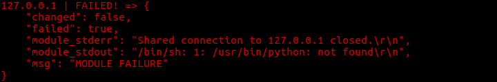
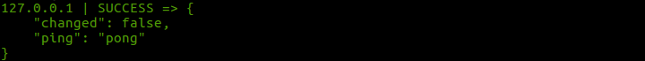
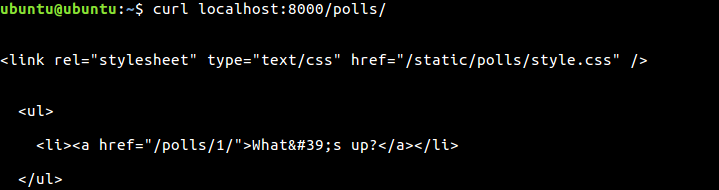
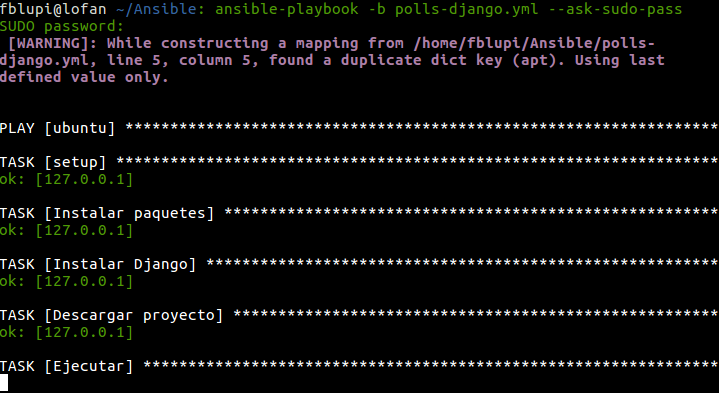

# Ejercicios

## Tema 2: Gestión de configuraciones

### Ejercicio 1

**Instalar chef en la máquina virtual que vayamos a usar**

```
curl -L https://www.opscode.com/chef/install.sh | sudo bash
```


### Ejercicio 2

**Crear una receta para instalar nginx, tu editor favorito y algún directorio y fichero que uses de forma habitual**

Voy a instalar emacs como editor, nginx, un directorio donde incluiré los repositorios clonados de GitHub y un fichero que lo explica.

Comienzo creando el directorio donde irá la receta

```
mkdir -p chef/cookboks/nginx/recipes
```

Creo la receta `default.rb` que irá dentro de este directorio:

```rb
package 'nginx'
package 'emacs'
directory '/home/fblupi/GitHub'
file "/home/fblupi/GitHub/LEEME.txt" do
  owner "fblupi"
  group "fblupi"
  mode 00544
  action :create
  content "Directorio para repos clonados"
end
```

Creo el fichero `node.json` en el directorio chef:

```js
{
  "run_list":["recipe[nginx]"]
}
```

Finalmente se crea el fichero de configuración `solo.rb` también en este directorio:

```rb
file_cache_path "/home/fblupi/chef"
cookbook_path "/home/fblupi/chef/cookbooks"
json_attribs "/home/fblupi/chef/node.json"
```

Finalmente se ejecuta:

```
sudo chef-solo -c chef/solo.rb
```


### Ejercicio 3

**Escribir en YAML la siguiente estructura de datos en JSON: `{ uno: "dos", tres: [ 4, 5, "Seis", { siete: 8, nueve: [ 10, 11 ] } ] }`**

```yaml
---
uno: "dos"
tres:
  - 4
  - 5
  - "Seis"
  - siete: 8
    nueve:
      - 10
      - 11
```

### Ejercicio 5

**Desplegar los fuentes de la aplicación de DAI o cualquier otra aplicación que se encuentre en un servidor git público en la máquina virtual Azure (o una máquina virtual local) usando Ansible**

Lo primero, instalar Ansible:

```
sudo pip install paramiko PyYAML jinja2 httplib2 ansible
```

Añadimos la máquina virtual al archivo de hosts de ansible. Para ello creamos el fichero `~/.ansible_hosts` con el siguiente contenido:

```
[ubuntu]
127.0.0.1 ansible_ssh_port=2281 ansible_ssh_user='ubuntu' ansible_ssh_private_key_file=~/.ssh/UbuntuVBox.pem
```

Indicamos a ansible dónde está este archivo con una variable de entorno:

```
export ANSIBLE_HOSTS=~/.ansible_hosts
```

Compruebo la conexión con:

```
ansible ubuntu -m ping
```

Si aparece el siguiente error:



Para resolverlo, conectarse vía ssh a la máquina virtual e instalar python:

```
sudo apt-get install python
```

Volver a comprobar la conexión y ver que funciona:



Ya conectados a la máquina virtual vamos a empezar a instalar dependencias:

```
ansible ubuntu -m command -a "sudo apt-get install git build-essential python-setuptools python-dev -y" --ask-sudo-pass
ansible ubuntu -m command -a "sudo easy_install pip" --ask-sudo-pass
ansible ubuntu -m command -a "sudo pip install django" --ask-sudo-pass
```

Descargar la aplicación:

```
ansible ubuntu -m git -a "repo=https://github.com/fblupi/polls-django.git dest=~/polls-django version=HEAD"
```

Ejecutarla:

```
ansible ubuntu -m command -a "sudo python polls-django/manage.py runserver" --ask-sudo-pass
```

Realizamos una prueba de que está funcionando:



### Ejercicio 6

**Desplegar la aplicación que se haya usado anteriormente con todos los módulos necesarios usando un playbook de Ansible**

El playbook es el siguiente:

```yml
- hosts: ubuntu
  become: yes
  become_user: ubuntu
  tasks:
  - name: Instalar paquetes
    apt: name=git state=present
    apt: name=build-essential state=present
    apt: name=python-setuptools state=present
    apt: name=python-dev state=present
  - name: Instalar Django
    pip: name=django
  - name: Descargar proyecto
    git: repo=https://github.com/fblupi/polls-django.git dest=~/polls-django clone=yes force=yes
  - name: Ejecutar
    command: nohup python ~/polls-django/manage.py runserver
```

Se ejecuta con:

```
ansible-playbook -b polls-django.yml --ask-sudo-pass
```



Realizamos una prueba de que está funcionando:


---

Volver a [home](index).
