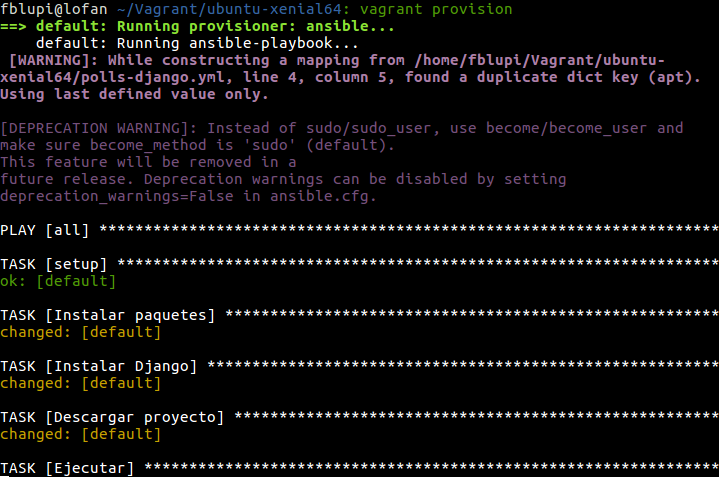
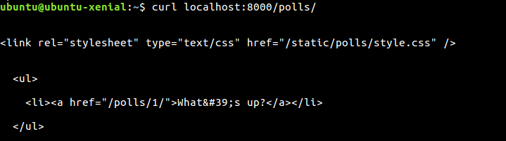

# Ejercicios

## Tema 3: Orquestación de máquinas virtuales

### Ejercicio 1

**Instalar una máquina virtual Debian usando Vagrant y conectar con ella**

```
vagrant box add https://github.com/holms/vagrant-jessie-box/releases/download/Jessie-v0.1/Debian-jessie-amd64-netboot.box
```


```
vagrant init debian-jessie
```


```
vagrant up
```


```
vagrant ssh
```


### Ejercicio 2

**Crear un script para provisionar `nginx` o cualquier otro servidor web que pueda ser útil para alguna otra práctica**

Cambiar el archivo `Vagrantfile`:

```rb
Vagrant.configure("2") do |config|
  config.vm.box = "debian-jessie"
  config.vm.provision "shell", inline: "sudo apt-get update && sudo apt-get install -y nginx"
end
```

Ejecutar en consola:

```
vagrant provision
```


### Ejercicio 3

**Configurar tu máquina virtual usando `vagrant` con el provisionador
ansible**

En primer lugar descargamos la máquina virtual:

```
vagrant box add https://atlas.hashicorp.com/ubuntu/boxes/xenial64
```


A continuación iniciamos una instancia la máquina virtual:

```
vagrant init ubuntu/xenial64
```


Lanzampos la máquina:

```
vagrant up
```


Conectarse vía ssh e instalar python:

```
vagrant ssh
sudo apt-get install python
exit
```


Editamos el `Vagrantfile`:

```rb
# -*- mode: ruby -*-
# vi: set ft=ruby :

Vagrant.configure("2") do |config|
  config.vm.box = "ubuntu/xenial64"
  config.vm.provision "ansible" do |ansible|
    ansible.playbook = "polls-django.yml"
  end
end
```

y añadimos el archivo `polls-django.yml`

```yml
- hosts: all
  sudo: true
  tasks:
  - name: Instalar paquetes
    apt: name=git state=present
    apt: name=build-essential state=present
    apt: name=python-setuptools state=present
    apt: name=python-dev state=present
    apt: name=python-pip state=present
  - name: Instalar Django
    pip: name=django
  - name: Descargar proyecto
    git: repo=https://github.com/fblupi/polls-django.git dest=~/polls-django clone=yes force=yes
  - name: Ejecutar
    command: python ~/polls-django/manage.py runserver
```

Provisionar:

```
vagrant provision
```



Realizamos una prueba de que está funcionando:



---

Volver a [home](index).
