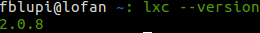
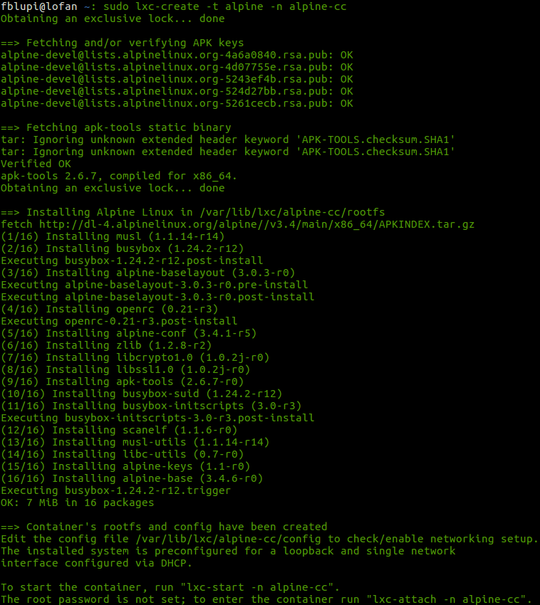
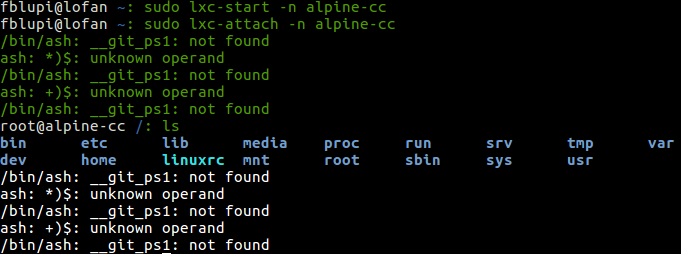
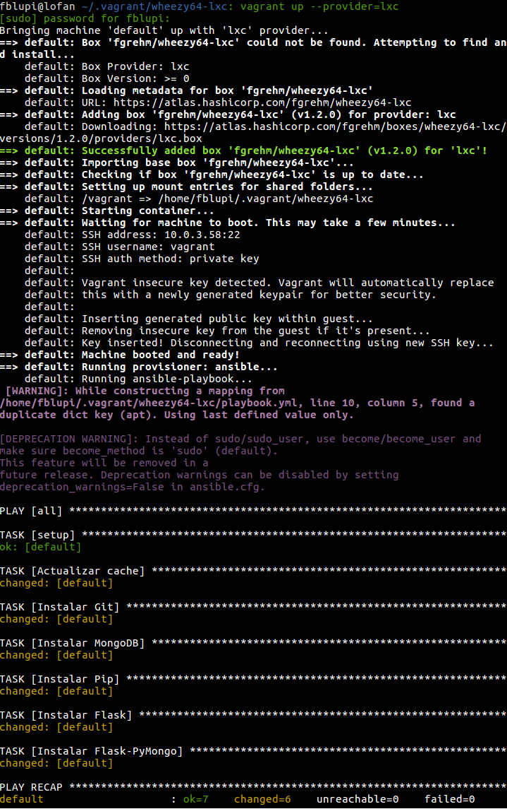
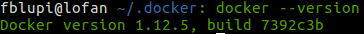
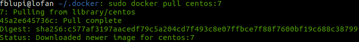

# Ejercicios

## Tema 5: Contenedores

### Ejercicio 1

**Instala LXC en tu versión de Linux favorita. Normalmente la versión en desarrollo, disponible tanto en GitHub como en el sitio web está bastante más avanzada; para evitar problemas sobre todo con las herramientas que vamos a ver más adelante, conviene que te instales la última versión y si es posible una igual o mayor a la 2.0.**

```
sudo add-apt-repository ppa:ubuntu-lxc/lxc-lts
sudo apt-get update
sudo apt-get install lxc
```



### Ejercicio 2

**Instalar una distro tal como Alpine y conectarse a ella usando el nombre de usuario y clave que indicará en su creación.**

Instalar:

```
sudo lxc-create -t alpine -n alpine-cc
```



Arrancar y conectarse:

```
sudo lxc-start -n alpine-cc
sudo lxc-attach -n alpine-cc
```



*Los fallos de `__git_ps1` son porque se hereda mi `.bash_profile` y Alpine usa `ash`.*

### Ejercicio 3

**Provisionar un contenedor LXC usando Ansible o alguna otra herramienta de configuración que ya se haya usado.**

Se ha realizado utilizando Vagrant. Para ello, primero hay que instalar el *plugin*:

```
vagrant plugin install vagrant-lxc
```

Creo una máquina virtual:

```
vagrant init fgrehm/wheezy64-lxc
```

Copiar el `playbook.yml`de [aquí](https://github.com/fblupi/GEventator/blob/master/provision/Ansible/playbook.yml) y cambio el `Vagrantfile` para que lo utilice:

```rb
Vagrant.configure("2") do |config|
  config.vm.box = "fgrehm/wheezy64-lxc"
  config.vm.provision "ansible" do |ansible|
    ansible.playbook = "playbook.yml"
  end
end
```

Inicio:

```
vagrant up --provider=lxc
```



### Ejercicio 4

**Instalar una imagen alternativa de Ubuntu y alguna adicional, por ejemplo de CentOS.**

Instalar Docker:

```
sudo apt-get update
sudo apt-get install apt-transport-https ca-certificates
sudo apt-key adv --keyserver hkp://ha.pool.sks-keyservers.net:80 --recv-keys 58118E89F3A912897C070ADBF76221572C52609D
echo "deb https://apt.dockerproject.org/repo ubuntu-xenial main" | sudo tee /etc/apt/sources.list.d/docker.list
sudo apt-get update
apt-cache policy docker-engine
sudo apt-get update
sudo apt-get install linux-image-extra-$(uname -r) linux-image-extra-virtual
sudo apt-get update
sudo apt-get install docker-engine
sudo service docker start
```



Instalar Ubuntu:

```
sudo docker pull ubuntu
```


Instalar CentOS:

```
sudo docker pull centos:7
```



---

Volver a [home](index).
